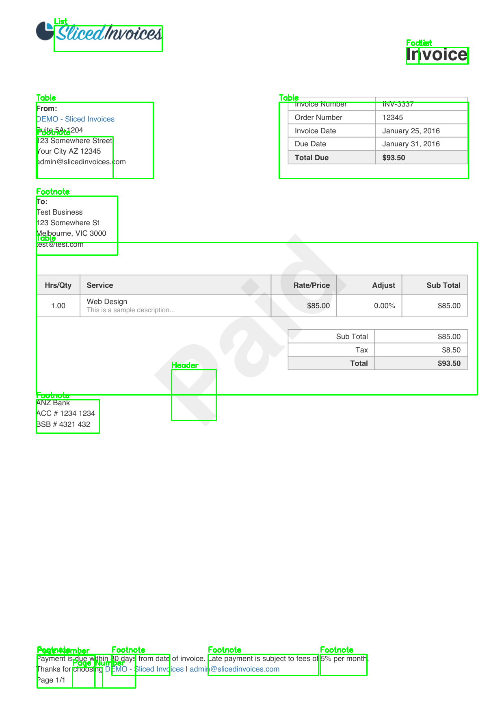
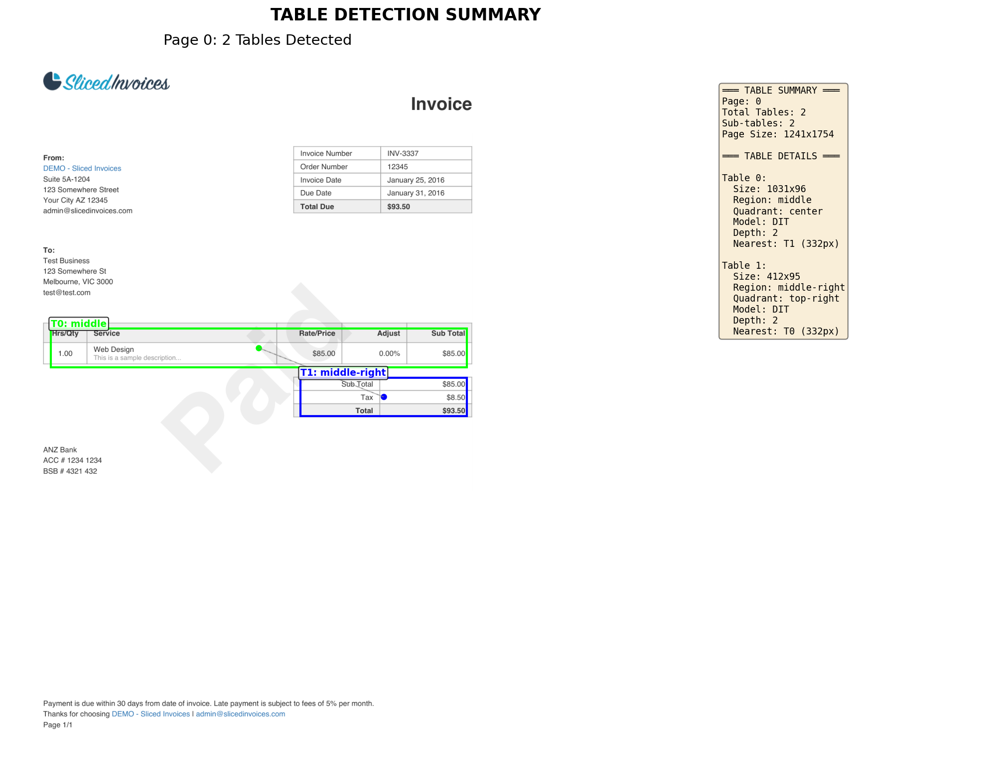

# EasyRag

<p align="center"></p>

<p align="center">
  
  
  
  
  
</p>

EasyRag is a modular, enterprise-grade Retrieval-Augmented Generation (RAG) platform that extracts structured data from PDF documents with high precision. Features a pluggable provider architecture supporting any combination of local and cloud AI services.

---

## Overview

- **Modular Architecture**: Pluggable provider system supporting Ollama, OpenAI, Anthropic, HuggingFace
- **Document Processing**: Extracts structured tables from PDFs with precise coordinate mapping
- **Semantic Search**: Vector embeddings indexed in Qdrant for fast, accurate retrieval  
- **Runtime Flexibility**: Switch between providers via API without restart

---

## Table of Contents

- Quick Start
- Provider Architecture
- Features
- Installation
- Configuration
- Local LLM (GPU)
- Table Detection (TADetect → DIT)
- Pipeline: PDF → Raster → Detect → Extract
- Examples & Docs
- Developer Notes
- Contributing
- License

---

## Quick Start

**Prerequisites**: Python 3.11+, Node.js 18+, Docker Compose, 8GB+ RAM recommended

**Automated Setup** (Windows):

```powershell
.\setup.bat
```

**Manual Setup**:

```bash
git clone https://github.com/malkhabir/EasyRag.git
cd EasyRag
# Backend
cd rag-service
python -m venv venv
# Windows: venv\Scripts\activate
pip install -r requirements.txt
python -m uvicorn main:app --host 0.0.0.0 --port 8080 --reload
# Frontend
cd ../frontend
npm install
npm run dev
```

**Access Points**:
- Frontend: http://localhost:5173
- API Documentation: http://localhost:8080/docs

---

## Provider Architecture

EasyRag features a modular provider system that supports any combination of local and cloud AI services. Switch providers at runtime via API without restarting the application.

### Supported Providers

**LLM Providers**:
- **Ollama** (local): `phi3`, `llama2`, `codellama` 
- **OpenAI**: `gpt-3.5-turbo`, `gpt-4`, `gpt-4-turbo`
- **Anthropic**: `claude-3-sonnet`, `claude-3-haiku`
- **Azure OpenAI**: Enterprise deployments

**Embedding Providers**:
- **HuggingFace** (local): `BAAI/bge-m3`, `sentence-transformers/all-MiniLM-L6-v2`
- **OpenAI**: `text-embedding-3-small`, `text-embedding-3-large`
- **Azure OpenAI**: Enterprise embeddings

### Configuration

Configure providers in `config/providers.yaml`:

```yaml
active_llm_provider: "local"
active_embedding_provider: "huggingface"

llm_providers:
  local:
    provider: "ollama"
    model_name: "phi3"
    host: "localhost"
    port: 11434
    
  openai:
    provider: "openai" 
    model_name: "gpt-3.5-turbo"
    # api_key: ${OPENAI_API_KEY}
```

### Runtime Provider Switching

Switch providers via API:

```bash
# List available providers
curl http://localhost:8080/api/v1/providers/llm

# Switch LLM provider
curl -X POST http://localhost:8080/api/v1/providers/llm/switch \
  -H "Content-Type: application/json" \
  -d '{"provider_name": "openai", "model_name": "gpt-4"}'

# Check system status
curl http://localhost:8080/api/v1/providers/status
```

---

## Technology Stack & Architecture

**Frontend Layer**: React + Vite application with PDF viewer, document upload, and interactive querying interface

**Backend Layer**: FastAPI service with modular provider architecture supporting multiple AI backends

**Infrastructure Layer**: Qdrant vector database, configurable LLM runtime, and model artifact storage

---

## Core Features

- **Modular Provider System**: Pluggable architecture supporting any LLM or embedding service
- **Runtime Model Switching**: Change AI providers via API without application restart
- **Advanced Table Detection**: Two-stage pipeline (TADetect + DIT) optimizing for both speed and accuracy
- **Multi-format Export**: Structured data output in CSV, Markdown, and JSON with preserved coordinates
- **Configurable Embeddings**: Flexible model selection with row-level semantic indexing
- **Source Attribution**: LLM responses include precise document locations and highlighting

---

## Installation & Running

Automated setup scripts available for both Windows (`setup.bat`) and Linux/macOS (`setup.sh`).

**Docker Infrastructure**:

```bash
docker compose up -d qdrant ollama
```

See `docker-compose.yml` for GPU-enabled Ollama configurations.

---

## Configuration

### Environment Setup

Copy `.env.example` to `.env` and configure your providers:

```bash
cp .env.example .env
```

Key configuration options:

```bash
# Active Providers
EASYRAG_ACTIVE_LLM_PROVIDER=local
EASYRAG_ACTIVE_EMBEDDING_PROVIDER=huggingface

# API Keys (for cloud providers)
OPENAI_API_KEY=your_openai_api_key_here
ANTHROPIC_API_KEY=your_anthropic_api_key_here

# Local Ollama Configuration
EASYRAG_LLM_PROVIDERS__LOCAL__HOST=localhost
EASYRAG_LLM_PROVIDERS__LOCAL__PORT=11434
```

### Provider Configuration

Detailed provider settings in `config/providers.yaml`. The system supports:

- **Hot-swapping**: Change providers via API without restart
- **Health monitoring**: Automatic provider health checks
- **Fallback support**: Graceful handling of unavailable providers
- **Multi-tenant**: Different models per tenant/user (enterprise)

---

## Local LLM (Ollama) — GPU considerations

Ensure host NVIDIA drivers match the CUDA runtime in the Ollama GPU image. For Linux use `nvidia-docker2`/`nvidia-container-toolkit`. On Windows, use Docker Desktop + WSL2 + NVIDIA WSL drivers.

Quick checks:

```bash
nvidia-smi
docker run --rm --gpus all nvidia/cuda:12.2.0-base-ubuntu22.04 nvidia-smi
```

Compose snippet (request GPUs):

```yaml
services:
  ollama:
    image: ollama/ollama:latest-gpu
    device_requests:
      - driver: nvidia
        count: all
        capabilities: [gpu]
```

---

## Table Detection (TADetect → DIT)

Pipeline rationale:

- TADetect (fast): global high-recall proposals to avoid missed tables.
- DIT (refine): per-crop transformer model that returns exact cell boundaries and nested structure.

This combination gives strong recall and the precise structure necessary for extraction and LLM-friendly serialization.

---

## Pipeline: PDF → Raster → Detect → Extract

Visual diagram and math are in `docs/pipeline_diagram.svg`.

Steps summary:

1. Rasterize PDF page → image (e.g., 300 DPI).
2. Run TADetect → get candidate boxes (pixels).
3. Crop + run DIT on proposals → fine cell boxes (relative to crop).
4. Expand/pad boxes and normalize coordinates.
5. IOU filtering: remove tiny/duplicate boxes and merge overlapping detections.
6. Map final pixel coords → PDF points for precise frontend highlights.
7. Parse tables (Camelot/custom) → rows/cells, serialize to CSV/JSON/Markdown.
8. Create embedding records (text + metadata) and assemble `Document` objects for indexing.

Why store both pixel and PDF coords?

- Pixel coords are useful for image overlays and debugging.
- PDF coords are essential to map highlights to the original vector PDF for exact provenance.

---

## Examples & Docs

- TADetect summary image: `rag-service/imgs/rasterized/PDF Invoice Example_temp_page_0.png`
- DIT annotated invoice: `rag-service/imgs/rasterized/PDF Invoice Example_annotated_page_0.png`
- Pipeline diagram: `docs/pipeline_diagram.svg`

Additional documentation and examples available in the repository structure.

---

## Developer Notes

- Core extraction: `rag-service/app/document_processing/`
- Vector DB: `rag-service/app/db/qdrant.py`
- LLM/embeddings wrappers: `rag-service/app/models/`

**Technical Considerations**:

- Maintain consistent embedding dimensions across ingestion and query pipelines
- Select uniform embedding granularity (row-level or cell-level) per dataset for optimal retrieval performance

---

## Contributing

1. Fork the repository
2. Create a feature branch: `git checkout -b feature/your-enhancement`
3. Implement changes with appropriate test coverage
4. Submit a pull request with detailed description

---

## License

MIT — see `LICENSE`.

---

<p align="center">Professional document intelligence platform built with modern AI/ML technologies</p>

```python
# rag-service/app/models/llm.py

class LLMProvider(ABC):
    @abstractmethod
    def generate(self, prompt: str, context: str) -> str:
        pass

class OpenAIProvider(LLMProvider):
    def generate(self, prompt: str, context: str) -> str:
        # Implement OpenAI API call
        pass

class AnthropicProvider(LLMProvider):
    def generate(self, prompt: str, context: str) -> str:
        # Implement Claude API call
        pass
```

### Adding a New Embedding Model

```python
# rag-service/app/models/embedding.py

class EmbeddingProvider(ABC):
    @abstractmethod
    def embed(self, texts: List[str]) -> List[List[float]]:
        pass

class OpenAIEmbeddings(EmbeddingProvider):
    def embed(self, texts: List[str]) -> List[List[float]]:
        # Implement text-embedding-3-large
        pass
```

### Adding a New Document Type

```python
# rag-service/app/document_processing/extractors/excel_extractor.py

class ExcelExtractor(BaseExtractor):
    def extract(self, file_path: str) -> List[Document]:
        # Parse Excel sheets as tables
        pass
```

---

## Testing

```bash
cd rag-service
pytest tests/ -v

# With coverage
pytest tests/ --cov=app --cov-report=html
```

---

## Deployment

### Docker (Recommended)

```bash
# Start all services
docker-compose up -d

# Check status
docker-compose ps

# View logs
docker-compose logs -f
```

### VS Code Tasks

Use the built-in VS Code tasks for quick actions:
- `Ctrl+Shift+P` → "Tasks: Run Task"
- Select from: Docker Start, RAG Service, Frontend Dev, etc.

### Manual

See [LAUNCH_INSTRUCTIONS.md](LAUNCH_INSTRUCTIONS.md) for detailed setup.

---

## Local LLM (Ollama) — GPU & NVIDIA considerations

EasyRag supports running local LLMs via Ollama. For GPU-accelerated inference (recommended for larger models), ensure the host and Docker environment are configured for NVIDIA GPU passthrough. Below are practical checks, installation hints, Docker/Compose snippets, and troubleshooting tips.

- **Quick checks**
  - Verify driver and GPU visibility on the host:

```bash
nvidia-smi
```

  - Verify Docker can access GPUs:

```bash
docker run --rm --gpus all nvidia/cuda:12.2.0-base-ubuntu22.04 nvidia-smi
```

- **Driver / CUDA compatibility rule**
  - The host NVIDIA driver must be recent enough to support the CUDA runtime used by your Ollama image. If you see a mismatch, update the host driver.

- **Install hints**
  - Ubuntu (example):

```bash
# Install an appropriate NVIDIA driver (follow your distro docs)
sudo apt install nvidia-driver-535

# Install NVIDIA Container Toolkit
distribution=$(. /etc/os-release;echo $ID$VERSION_ID)
curl -s -L https://nvidia.github.io/nvidia-docker/gpgkey | sudo apt-key add -
curl -s -L https://nvidia.github.io/nvidia-docker/$distribution/nvidia-docker.list | sudo tee /etc/apt/sources.list.d/nvidia-docker.list
sudo apt update
sudo apt install -y nvidia-docker2
sudo systemctl restart docker
```

  - Windows (WSL2 + Docker Desktop): install the **NVIDIA WSL driver**, enable WSL2 backend in Docker Desktop, and test `nvidia-smi` inside WSL.

- **Docker Compose (recommended) — request GPUs**
  - Use `device_requests` for Compose v2+ to request GPUs for the `ollama` service:

```yaml
services:
  ollama:
    image: ollama/ollama:latest-gpu   # use a GPU-enabled tag if available
    device_requests:
      - driver: nvidia
        count: all
        capabilities: [gpu]
    environment:
      - NVIDIA_VISIBLE_DEVICES=all
```

- **Running Ollama with GPU**
  - Run a GPU-enabled Ollama image with Docker:

```bash
docker run --gpus all --rm -it ollama/ollama:gpu-tag ollama serve
```

- **Model & runtime considerations**
  - Large LLMs require significant VRAM (12GB+ for many models). Prefer models that support FP16 / quantization to lower memory usage.
  - Multi-GPU setups may require sharding or frameworks that support parallelism.

- **Troubleshooting**
  - `CUDA driver version is insufficient` → update the NVIDIA driver on the host.
  - `could not select device driver` → install/restart `nvidia-docker2` or enable WSL2 GPU support on Windows.
  - `nvidia-smi` works on host but Docker test fails → confirm `nvidia-container-toolkit` is installed and `docker` restarted.
 
## Table Detection Examples (TADetect → DIT)

Below are two example outputs from the table-detection pipeline used by EasyRag. The first is a compact "detection summary" image showing high-level regions identified as tables (a fast TADetect pass). The second is an annotated invoice page showing detailed table cell boundaries and the final structure used for extraction (a DIT + Camelot pass).

<div style="display:flex;gap:24px;flex-wrap:wrap">
  <div style="flex:1;min-width:320px">
    <p><strong>Table Detection Summary (coarse)</strong></p>
    
    <p style="font-size:90%">Fast region proposals from TADetect. These boxes identify candidate table areas quickly so we can focus heavier processing where it matters.</p>
  </div>

  <div style="flex:1;min-width:320px">
    <p><strong>Annotated Invoice (detailed)</strong></p>
    
    <p style="font-size:90%">Detailed layout and cell boundaries produced by the DIT stage and post-processing (Camelot/coordinate extraction). This output is converted to CSV/JSON for downstream indexing and LLM prompts.</p>
  </div>
</div>

Why we run TADetect first, then DIT
- TADetect (fast detector): Locate candidate table regions across the whole page quickly. It's optimized for speed and high recall so we don't miss tables.
- DIT (detailed detector / transformer-based refinement): Run only on the candidate regions found by TADetect to produce precise cell boundaries, nested tables, and fine-grained structure suitable for extraction.

This two-stage approach gives us the best trade-off between speed and accuracy: cheap global scanning followed by an expensive, precise pass only where needed.

How LLMs ingest tables (and why we extract structure)
- LLMs perform best when given concise, structured table data rather than raw OCR text. We therefore convert detected tables into:
  - tabular CSV or Markdown (header row + typed columns),
  - a short textual schema summary (columns, types, key units), and
  - contextual metadata (page number, coordinates, source filename) so answers can link back to the source.
- Practical tips we apply:
  - Preserve header rows and column order — they give models important semantic anchors.
  - Avoid pasting very wide tables directly into prompts; instead provide a small representative chunk + a schema summary and point the model to the exact rows when needed.
  - Provide the LLM with provenance (page/coords) when the user asks for source highlighting or verification.

Why this matters for EasyRag
- Accurate table localization + structure extraction enables precise semantic indexing (embeddings per row/cell) so retrieval returns the most relevant table rows for a query.
- Structured table outputs allow the query service to produce succinct, verifiable answers and to include clickable source highlights in the frontend PDF viewer.
 
## PDF → Raster → Detection → Extraction Pipeline (step-by-step)

This section explains the exact path a PDF takes inside EasyRag from an uploaded file to a structured `Document` object that is indexed for search and used in LLM prompts.

1. PDF rasterization
  - Convert each PDF page to a high-resolution raster image (PNG/JPEG). Rasterization normalizes fonts/positions and is required for vision-based detectors (TADetect / DIT) that operate on pixels.
  - Typical settings: 300 DPI (tunable by file type and expected table detail).

2. Fast region proposal (TADetect)
  - Run a lightweight, high-recall table detector across the raster image to obtain candidate table bounding boxes. This stage is optimized for speed and to avoid missed tables.

3. Region crop & refinement (DIT)
  - For each candidate box, crop the raster image and run the DIT (detailed layout transformer) model to predict precise cell boundaries and nested table structure.
  - DIT outputs fine-grained box coordinates relative to the cropped image plus labels for header/footer/cell types.

4. Expand & normalize box coordinates
  - Optionally expand the DIT boxes slightly (padding) to include cell borders and nearby context (helps table parsers like Camelot recover separators).
  - Normalize coordinate formats so all boxes use the same origin/units (e.g., pixels, top-left origin).

5. IOU-based filtering & de-duplication
  - Compute pairwise IOU (intersection-over-union) among detected boxes and between TADetect proposals and DIT boxes.
  - Use IOU thresholds to: (a) drop tiny false-positive boxes, (b) merge near-duplicate detections, and (c) prefer higher-confidence DIT boxes over coarse proposals.
  - This reduces noise and prevents overlapping/ambiguous table regions from polluting downstream extraction.

6. Convert coordinates back to PDF space
  - Map the final pixel coordinates (from raster / crop math) back to PDF coordinates (points) so the frontend can highlight exact areas on the original PDF page.
  - Store both coordinate systems — pixel for image overlays and PDF points for vector-aware viewers.

7. Table parsing & serialization
  - For each final table region, run a table parser (e.g., Camelot or custom coordinate-based extractor) to produce rows/cells.
  - Serialize table outputs to CSV, Markdown, and a compact JSON representation that preserves header rows, cell spans, and numeric parsing.

8. Embedding metadata & document object creation
  - For indexing, create embedding entries at a chosen granularity (row-level, cell-level, or table-level). Each embedding record includes:
    - `text`: the text used for embedding (e.g., row as CSV or Markdown snippet)
    - `source`: original filename
    - `page`: page number
    - `coords_pdf`: rectangle in PDF points
    - `coords_px`: rectangle in raster pixels
    - `table_id` / `row_id`: identifiers for provenance
  - Create the final `Document` object (example schema below) that the rest of EasyRag consumes for retrieval and QA.

9. Example `Document` object (simplified)

```json
{
  "id": "file.pdf::page_3",
  "filename": "file.pdf",
  "page": 3,
  "tables": [
   {
    "table_id": "t0",
    "coords_pdf": [100.2, 710.3, 450.7, 620.1],
    "coords_px": [1200, 900, 2400, 720],
    "rows": [
      {"row_id": "r0", "text": "Item,Qty,Price", "embedding_id": "e-123"},
      {"row_id": "r1", "text": "Widget,2,$10.00", "embedding_id": "e-124"}
    ]
   }
  ],
  "metadata": {"uploaded_by": "user@example.com", "created_at": "2026-01-08T12:00:00Z"}
}
```

10. Indexing & retrieval
   - Embeddings created from each `embedding_id` are stored in the vector store (Qdrant) along with the `coords_pdf` and `table_id` within the payload/metadata.
   - During retrieval, returned items include provenance data so UI can highlight source location and the query service can assemble an LLM prompt that includes the most relevant table rows + schema context.

Notes and rationale
- Working on rasters lets us use robust, vision-based detectors that are model-agnostic and stable across varied PDF encodings.
- Converting coordinates back to PDF points is essential for accurate source highlighting in the UI and for any downstream human verification.
- IOU filtering is a simple but effective way to reduce duplicated/low-quality detections before expensive parsing and embedding work.
- Storing both pixel and PDF coordinates ensures the same detection can be used for both image overlays (frontend previews) and precise PDF-based annotations.

If you'd like, I can add a small diagram (SVG) into the docs that visually shows these transformations and math for mapping pixel→PDF coordinates — tell me and I'll add one.
The diagram below visualizes the pipeline and the pixel↔PDF coordinate math.


## Contributing

1. Fork the repository
2. Create a feature branch (`git checkout -b feature/amazing-feature`)
3. Commit your changes (`git commit -m "Add amazing feature"`)
4. Push to the branch (`git push origin feature/amazing-feature`)
5. Open a Pull Request

---

## License

MIT License - see [LICENSE](LICENSE) for details.

---

## Acknowledgments

- [Ollama](https://ollama.com/) - Local LLM runtime
- [Qdrant](https://qdrant.tech/) - Vector database
- [BGE-M3](https://huggingface.co/BAAI/bge-m3) - Embedding model
- [Camelot](https://camelot-py.readthedocs.io/) - PDF table extraction
- [DIT](https://github.com/microsoft/unilm/tree/master/dit) - Document layout detection
- [PyMuPDF (fitz)](https://pymupdf.readthedocs.io/) - PDF rendering and low-level text extraction (uses `fitz`)

---
<p align="center">
  <a href="#-easyrag">Back to top ↑</a>
</p>
