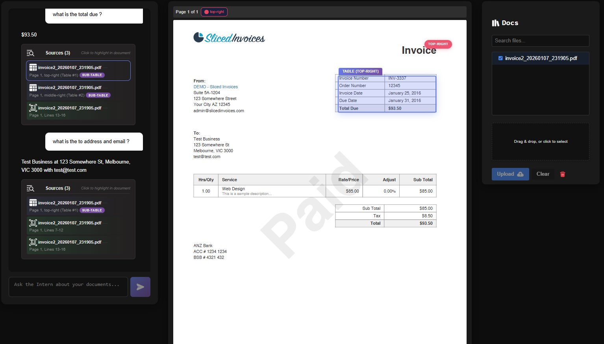

# EasyRag

<p align="center"></p>

<p align="center">
  
  
</p>

<p align="center">
  
  
  
  
</p>

<p align="center">
  
  
  
  
</p>

<p align="center">
  
  
  
  
</p>

EasyRag is a modular Retrieval-Augmented Generation (RAG) platform that extracts structured data from PDF documents with high precision. Features a pluggable provider architecture supporting any combination of local and cloud AI services. This project can serve as a proof of concept or maybe more than that. If you are looking to understand how RAG works then this is the project for you.

<div style="flex:1;min-width:320px">
  <p><strong>Web Interface - Query & Highlight</strong></p>
  
  <p style="font-size:90%">Ask questions about your uploaded documents and get AI-powered answers with precise source highlighting. The system identifies exactly where in the PDF the answer was found, enabling quick verification and traceability.</p>
</div>

---

## Table of Contents

- [Overview](#overview)
- [Quick Start](#quick-start)
- [Provider Architecture](#provider-architecture)
- [Technology Stack](#technology-stack)
- [Vector Search & Embeddings](#vector-search--embeddings)
- [Table Detection Pipeline](#table-detection-pipeline)
- [API Reference](#api-reference)
- [Configuration](#configuration)
- [GPU Setup (Ollama)](#gpu-setup-ollama)
- [Testing & Deployment](#testing--deployment)
- [Developer Guide](#developer-guide)
- [Contributing](#contributing)
- [License](#license)

[↑ Back to top](#easyrag)

---

## Overview

- **Modular Architecture**: Pluggable provider system supporting Ollama, OpenAI, Anthropic, HuggingFace
- **Document Processing**: Extracts structured tables from PDFs with precise coordinate mapping
- **Semantic Search**: Vector embeddings indexed in Qdrant for fast, accurate retrieval
- **Runtime Flexibility**: Switch between providers via API without restart
- **Source Attribution**: LLM responses include precise document locations and highlighting

---

## Quick Start

**Prerequisites**: Python 3.11+, Node.js 18+, Docker Compose, 8GB+ RAM recommended

### Automated Setup (Windows)

```powershell
.\setup.bat
```

### Manual Setup

```bash
git clone https://github.com/malkhabir/EasyRag.git
cd EasyRag

# Start infrastructure
docker compose up -d qdrant ollama

# Backend
cd rag-service
python -m venv venv
# Windows: venv\Scripts\activate | Linux/Mac: source venv/bin/activate
pip install -r requirements.txt
python -m uvicorn main:app --host 0.0.0.0 --port 8080 --reload

# Frontend (new terminal)
cd frontend
npm install
npm run dev
```

**Access Points**:
- Frontend: http://localhost:5173
- API Documentation: http://localhost:8080/docs

---

## Provider Architecture

EasyRag features a modular provider system that supports any combination of local and cloud AI services. Switch providers at runtime via API without restarting the application.

### Supported Providers

| Type | Provider | Models |
|------|----------|--------|
| **LLM** | Ollama (local) | `phi3`, `llama2`, `codellama` |
| | OpenAI | `gpt-3.5-turbo`, `gpt-4`, `gpt-4-turbo` |
| | Anthropic | `claude-3-sonnet`, `claude-3-haiku` |
| | Azure OpenAI | Enterprise deployments |
| **Embedding** | HuggingFace (local) | `BAAI/bge-m3`, `all-MiniLM-L6-v2` |
| | OpenAI | `text-embedding-3-small`, `text-embedding-3-large` |

### Provider Configuration

Configure providers in `config/providers.yaml`:

```yaml
active_llm_provider: "local"
active_embedding_provider: "huggingface"

llm_providers:
  local:
    provider: "ollama"
    model_name: "phi3"
    host: "localhost"
    port: 11434
    
  openai:
    provider: "openai" 
    model_name: "gpt-3.5-turbo"
    # api_key: ${OPENAI_API_KEY}
```

### Runtime Provider Switching

```bash
# List available providers
curl http://localhost:8080/api/v1/providers/llm

# Switch LLM provider
curl -X POST http://localhost:8080/api/v1/providers/llm/switch \
  -H "Content-Type: application/json" \
  -d '{"provider_name": "openai", "model_name": "gpt-4"}'

# Check system status
curl http://localhost:8080/api/v1/providers/status
```

---

## Technology Stack

| Layer | Technology | Version | Purpose |
|-------|------------|---------|---------|
| **Frontend** | React | 19.1.1 | UI component library |
| | Vite | 4.5.0 | Build tool and dev server |
| | react-pdf | 10.0.1 | PDF rendering in browser |
| | pdfjs-dist | 5.3.31 | Mozilla's PDF.js for parsing |
| **Backend** | Python | 3.11+ | Runtime environment |
| | FastAPI | 0.104.0+ | Async REST API framework |
| | Uvicorn | latest | ASGI server |
| | Pydantic | 2.0.0+ | Data validation and settings |
| **AI/ML** | LlamaIndex | latest | RAG orchestration framework |
| | PyTorch | latest | Deep learning framework |
| | Transformers | latest | HuggingFace model hub |
| | sentence-transformers | latest | Embedding models |
| | Detectron2 | 0.6+ | Object detection (tables) |
| **Vector DB** | Qdrant | latest | Vector similarity search |
| **LLM Providers** | Ollama | latest | Local LLM runtime |
| | OpenAI API | 1.0.0+ | Cloud LLM (optional) |
| | Anthropic API | 0.3.0+ | Claude models (optional) |
| **PDF Processing** | PyMuPDF (fitz) | latest | PDF rasterization |
| | pdfplumber | latest | Text extraction |
| | camelot-py | latest | Table extraction |
| | pytesseract | latest | OCR fallback |
| **Infrastructure** | Docker Compose | 3.9 | Container orchestration |

---

## Vector Search & Embeddings

EasyRag uses vector indexes to enable semantic search over documents.

### How It Works

```
Traditional Search: "revenue" → matches documents containing "revenue"
Vector Search: "how much money did we make" → matches documents about revenue, income, earnings, etc.
```

1. **Embedding Generation**: Text chunks are converted to 1024-dimensional vectors using BGE-M3
2. **Vector Storage**: Vectors are stored in Qdrant with metadata (page, coordinates, source file)
3. **Similarity Search**: Queries are embedded and compared using cosine similarity
4. **Top-K Retrieval**: Most similar chunks are retrieved and passed to the LLM

### Qdrant Configuration

| Feature | Value |
|---------|-------|
| Index Type | HNSW (Hierarchical Navigable Small World) |
| Distance Metric | Cosine Similarity |
| Vector Dimensions | 1024 (BGE-M3) |
| Storage | Persistent on disk with in-memory indexing |

```python
from qdrant_client.models import Distance, VectorParams

client.create_collection(
    collection_name="documents",
    vectors_config=VectorParams(
        size=1024,           # BGE-M3 embedding dimensions
        distance=Distance.COSINE
    )
)
```

### Similarity Metrics

| Metric | Range | Best For |
|--------|-------|----------|
| **Cosine** | 0 to 2 | Text embeddings, semantic similarity |
| **Dot Product** | -∞ to +∞ | Normalized vectors, recommendations |
| **Euclidean** | 0 to +∞ | Image features, spatial data |

**Why Cosine?** Measures the angle between vectors, ignoring magnitude. This means "revenue report" and "income statement" will score as highly similar even if one document is longer than the other.

### Embedding Model: BGE-M3

| Property | Value |
|----------|-------|
| Model | BAAI/bge-m3 |
| Dimensions | 1024 |
| Max Tokens | 8192 |
| Languages | 100+ (multilingual) |
| Features | Dense + Sparse + ColBERT retrieval |

### LlamaIndex Integration

EasyRag uses [LlamaIndex](https://www.llamaindex.ai/) as the core RAG framework:

```python
from llama_index.core import Settings, VectorStoreIndex

# Configure embeddings and LLM
Settings.embed_model = embed_model.get()  # HuggingFace BGE-M3
Settings.llm = llm_model.get()            # Ollama phi3/llama2

# Create vector store and index
vector_store = QdrantVectorStore(client=qdrant_client, collection_name="documents")
index = VectorStoreIndex.from_documents(documents, storage_context=storage_context)

# Query with similarity search
query_engine = index.as_query_engine(similarity_top_k=5)
response = query_engine.query("What is the total revenue?")
```

---

## Table Detection Pipeline

EasyRag uses a two-stage pipeline for accurate table extraction from PDFs.

### Pipeline Overview

```
PDF → Rasterize → TADetect (fast) → DIT (precise) → Parse → Embed → Index
```

<div style="display:flex;gap:24px;flex-wrap:wrap">
  <div style="flex:1;min-width:320px">
    <p><strong>TADetect (Stage 1)</strong></p>
    
    <p style="font-size:90%">Fast region proposals identifying candidate table areas.</p>
  </div>
  <div style="flex:1;min-width:320px">
    <p><strong>DIT (Stage 2)</strong></p>
    
    <p style="font-size:90%">Precise cell boundaries and structure for extraction.</p>
  </div>
</div>

### Why Two Stages?

- **TADetect (fast)**: High-recall detector scans entire page quickly to find candidate regions
- **DIT (precise)**: Transformer model runs only on candidates for exact cell boundaries

This gives the best trade-off: cheap global scanning + expensive precise pass only where needed.

### Detailed Steps

1. **Rasterize**: Convert PDF page to image (300 DPI)
2. **TADetect**: Get candidate table boxes (pixels)
3. **DIT**: Crop and refine to get cell boundaries
4. **Normalize**: Expand boxes, normalize coordinates
5. **Convert**: Map pixel coords → PDF points for highlighting
6. **Parse**: Extract rows/cells via Camelot, serialize to CSV/JSON/Markdown
7. **Embed**: Create embeddings with metadata (page, coords, source)
8. **Index**: Store in Qdrant for retrieval

### Document Object Schema

```json
{
  "id": "file.pdf::page_3",
  "filename": "file.pdf",
  "page": 3,
  "tables": [{
    "table_id": "t0",
    "coords_pdf": [100.2, 710.3, 450.7, 620.1],
    "coords_px": [1200, 900, 2400, 720],
    "rows": [
      {"row_id": "r0", "text": "Item,Qty,Price", "embedding_id": "e-123"},
      {"row_id": "r1", "text": "Widget,2,$10.00", "embedding_id": "e-124"}
    ]
  }]
}
```


---

## API Reference

### Document Endpoints

| Method | Endpoint | Description |
|--------|----------|-------------|
| `POST` | `/api/v1/upload` | Upload a PDF document |
| `GET` | `/api/v1/files` | List all uploaded files |
| `GET` | `/api/v1/files/{filename}` | Download/view a specific file |
| `DELETE` | `/api/v1/files/{filename}` | Delete a file |

### Query Endpoints

| Method | Endpoint | Description |
|--------|----------|-------------|
| `GET` | `/api/v1/query?q={query}` | Query documents with natural language |
| `GET` | `/api/v1/query?q={query}&files={file1}` | Query specific files |

### Provider Endpoints

| Method | Endpoint | Description |
|--------|----------|-------------|
| `GET` | `/api/v1/providers/llm` | List available LLM providers |
| `GET` | `/api/v1/providers/embedding` | List embedding providers |
| `POST` | `/api/v1/providers/llm/switch` | Switch LLM provider |
| `POST` | `/api/v1/providers/embedding/switch` | Switch embedding provider |
| `GET` | `/api/v1/providers/status` | System health status |

Full API documentation: http://localhost:8080/docs

---

## Configuration

### Environment Variables

Copy `.env.example` to `.env`:

```bash
# Active Providers
EASYRAG_ACTIVE_LLM_PROVIDER=local
EASYRAG_ACTIVE_EMBEDDING_PROVIDER=huggingface

# API Keys (for cloud providers)
OPENAI_API_KEY=your_openai_api_key_here
ANTHROPIC_API_KEY=your_anthropic_api_key_here

# Local Ollama Configuration
EASYRAG_LLM_PROVIDERS__LOCAL__HOST=localhost
EASYRAG_LLM_PROVIDERS__LOCAL__PORT=11434
```

---

## GPU Setup (Ollama)

For GPU-accelerated local LLMs, ensure proper NVIDIA configuration.

### Prerequisites

```bash
# Verify GPU on host
nvidia-smi

# Verify Docker GPU access
docker run --rm --gpus all nvidia/cuda:12.2.0-base-ubuntu22.04 nvidia-smi
```

### Linux Installation

```bash
# Install NVIDIA driver
sudo apt install nvidia-driver-535

# Install Container Toolkit
distribution=$(. /etc/os-release;echo $ID$VERSION_ID)
curl -s -L https://nvidia.github.io/nvidia-docker/gpgkey | sudo apt-key add -
curl -s -L https://nvidia.github.io/nvidia-docker/$distribution/nvidia-docker.list | \
  sudo tee /etc/apt/sources.list.d/nvidia-docker.list
sudo apt update && sudo apt install -y nvidia-docker2
sudo systemctl restart docker
```

### Windows (WSL2)

Install the NVIDIA WSL driver, enable WSL2 backend in Docker Desktop, and test `nvidia-smi` inside WSL.

### Docker Compose Configuration

```yaml
services:
  ollama:
    image: ollama/ollama:latest-gpu
    device_requests:
      - driver: nvidia
        count: all
        capabilities: [gpu]
    environment:
      - NVIDIA_VISIBLE_DEVICES=all
```

### Troubleshooting

| Error | Solution |
|-------|----------|
| `CUDA driver version is insufficient` | Update NVIDIA driver on host |
| `could not select device driver` | Install `nvidia-docker2` or enable WSL2 GPU |
| Docker test fails but host works | Restart Docker after installing toolkit |

---

## Testing & Deployment

### Running Tests

```bash
cd rag-service
pytest tests/ -v

# With coverage
pytest tests/ --cov=app --cov-report=html
```

### Docker Deployment

```bash
# Start all services
docker-compose up -d

# Check status
docker-compose ps

# View logs
docker-compose logs -f
```

### VS Code Tasks

Use built-in tasks via `Ctrl+Shift+P` → "Tasks: Run Task":
- Docker: Start Services
- RAG Service: Run Server
- Frontend: Run Dev Server

See [LAUNCH_INSTRUCTIONS.md](LAUNCH_INSTRUCTIONS.md) for detailed setup.

---

## Developer Guide

### Project Structure

```
rag-service/
├── app/
│   ├── api/v1/           # REST endpoints
│   ├── core/             # Config, logging
│   ├── db/               # Qdrant client
│   ├── document_processing/  # PDF extraction
│   ├── models/           # LLM & embedding wrappers
│   └── services/         # Business logic
└── tests/
```

### Adding a New LLM Provider

```python
# rag-service/app/models/providers/my_provider.py
from .base import LLMProvider

class MyProvider(LLMProvider):
    def generate(self, prompt: str, context: str) -> str:
        # Implement API call
        pass
```

### Adding a New Embedding Model

```python
# rag-service/app/models/embedding.py
class MyEmbeddings(EmbeddingProvider):
    def embed(self, texts: List[str]) -> List[List[float]]:
        # Return embedding vectors
        pass
```

### Technical Notes

- Maintain consistent embedding dimensions (1024 for BGE-M3) across pipelines
- Use row-level granularity for table embeddings for optimal retrieval
- Store both pixel and PDF coordinates for flexible highlighting

---

## Contributing

1. Fork the repository
2. Create a feature branch: `git checkout -b feature/amazing-feature`
3. Commit your changes: `git commit -m "Add amazing feature"`
4. Push to the branch: `git push origin feature/amazing-feature`
5. Open a Pull Request

---

## License

MIT License - see [LICENSE](LICENSE) for details.

---

## Acknowledgments

- [Ollama](https://ollama.com/) - Local LLM runtime
- [Qdrant](https://qdrant.tech/) - Vector database
- [LlamaIndex](https://www.llamaindex.ai/) - RAG framework
- [BGE-M3](https://huggingface.co/BAAI/bge-m3) - Embedding model
- [Camelot](https://camelot-py.readthedocs.io/) - PDF table extraction
- [DIT](https://github.com/microsoft/unilm/tree/master/dit) - Document layout detection
- [PyMuPDF](https://pymupdf.readthedocs.io/) - PDF rendering

---

<p align="center">
  <a href="#easyrag">↑ Back to top</a>
</p>
